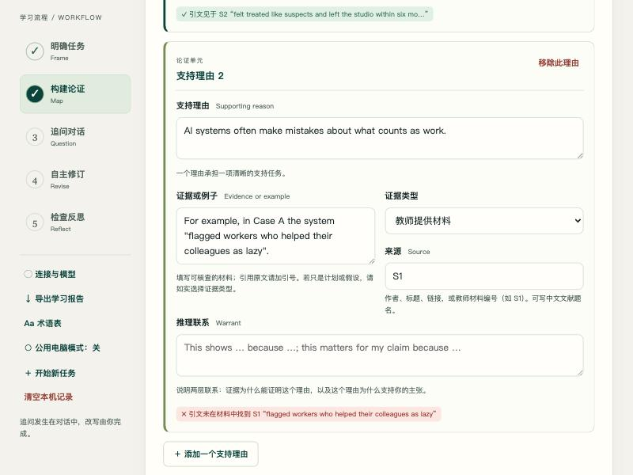
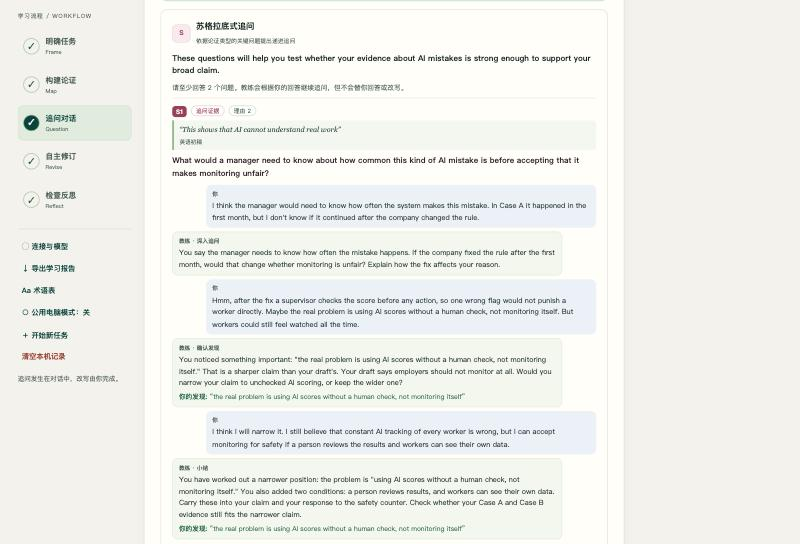
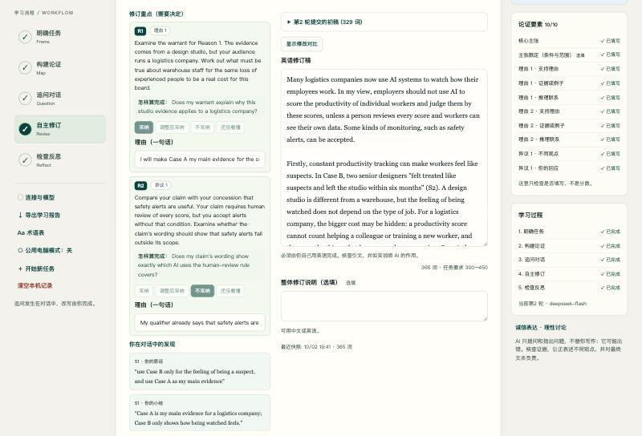
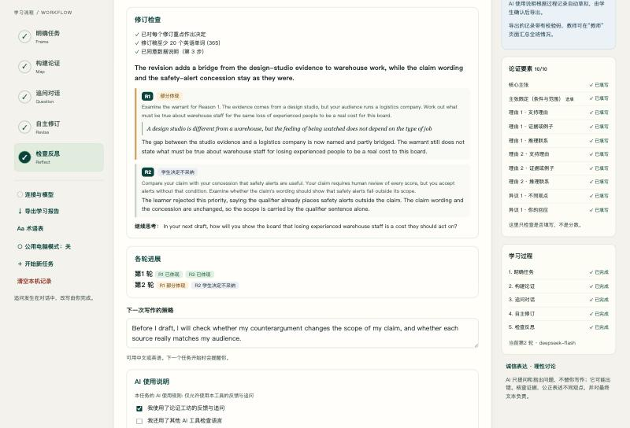
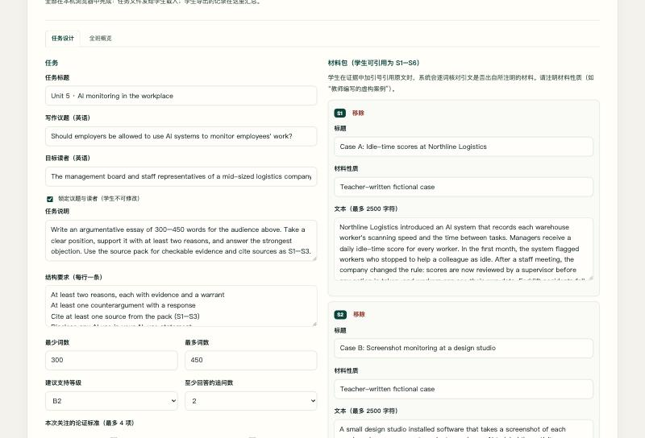

# Demo walkthrough — "Should employers be allowed to use AI to monitor employees' work?"

Open it yourself:

```bash
npm run start:offline      # no API key needed to replay the demo
```
then `http://localhost:4186/?demo=1`.

**What is real and what is simulated.** The learner is simulated — an AI assistant role-playing a second-year English major at B2 level. Every agent output, every Socratic follow-up and every revision check in the recording is a **real DeepSeek response**, captured live on 2 October 2026 (`deepseek-flash`, prompt version `38bd27ec863f`; 19 model calls across two rounds). Nothing was edited afterwards. The replay is read-only; the demo banner says so.

---

## Step 1 — Frame

The teacher task *Unit 5 · AI monitoring in the workplace* is loaded and **locks** the question and audience ("the management board and staff representatives of a mid-sized logistics company"). It supplies three sources: two teacher-written fictional cases and a teacher summary of data-protection principles, plus a ten-item topic vocabulary balanced across both sides of the issue.

The learner's opening claim:

> "Employers should not use AI systems to monitor their employees, because it is an invasion of privacy and it destroys the trust between workers and managers."

No qualifier. (Worth noting for later.)

---

## Step 2 — Map, and the first thing that happens has nothing to do with AI

Two reasons, each citing a source. The learner writes the evidence for Reason 2 as:

> In Case A the system *"flagged workers who helped their colleagues as lazy"*.

The source actually says *"flagged workers who stopped to help a colleague as idle"*. The learner has quoted from memory and got it wrong — a completely ordinary thing to do.

The tool marks it immediately:

> ✗ 引文未在材料中找到 S1 — *"flagged workers who helped their colleagues as lazy"*

**No model was called.** This is `checkSourceQuotes()` matching the quoted words against the cited source. The learner fixes it before any feedback is requested, and the marker turns green. "Check your sources" became a deterministic test instead of advice.



---

## Step 3 — Question

### Self-assessment comes first

Before the run, the learner picks the weakest element themselves:

> **Reason 2 warrant** — "I did not explain why one mistake in Case A means that AI monitoring is unfair in general."
> Question for the coach: "Is my response to the counterargument strong enough?"

### Four agents, 4 calls, 8.7 seconds

**Analyst** — structured checks first, then anchored observations:

| | |
|---|---|
| Claim | answers the question · **overbroad** |
| Reason 1 | teacher source · evidence link *partly* · claim link **missing** |
| Reason 2 | teacher source · evidence link **missing** · claim link **missing** |
| Counterargument 1 | stated fairly · response type *rebut* |

It responds to the learner's self-assessment before anything else:

> *"You correctly identified the missing warrant for Reason 2 as the most important issue. Your question about the counterargument is also relevant, but the warrant comes first."*

It also names one thing to **keep**, quoting the learner:

> *"If good employees leave, company will lose talent and money"* — "You connect the evidence to a concrete consequence for the company. This shows you are thinking about why the audience should care."

(The learner's grammar slip, "company will lose", is left alone — the analyst does not do language.)

**Socratic questioner** — three typed questions, each anchored:

- **S1** (evidence, Reason 2): "What would a manager need to know about how common this kind of AI mistake is before accepting that it makes monitoring unfair?"
- **S2** (alternative, Reason 2): "If a company fixed the AI so it no longer flagged helpful workers, would your reason against monitoring still stand?"
- **S3** (tension, Claim): "Your claim rejects all AI monitoring, yet your counterargument admits monitoring can warn drivers who drive too fast; how do these two positions fit together?"

S3 is the move that needs no outside facts: it puts two of the learner's **own** statements side by side.

**Language coach** — points at the learner's sentences, never rewrites:

- **L1** (stance, draft): on *"As we all know, privacy is a basic right"* — "This appeal to shared knowledge asks the board to accept a contested value as obvious. A manager who weighs safety against privacy may resist rather than be persuaded."
- **L2** (stance, Reason 2): on *"so it is totally unfair to use it to judge people"* — "The booster 'totally' is much stronger than one example from Case A can support."

**Coordinator** — two priorities, each with IDs it is based on and a self-check:

- **R1** (from A1, S1, L2): work on Reason 2's warrant. *Check: "Does my warrant explain why this example justifies rejecting AI monitoring, not just fixing it?"*
- **R2** (from A2, S3): compare the claim with the counterargument. *Check: "Does my claim's scope match the cases my evidence covers?"*

It also names the tension honestly:

> "The analyst wants a narrower claim, while your counterargument already concedes a use of monitoring; narrowing the claim would resolve both, but it changes the position you set out to defend."

### The dialogue — where the learning happens

**S1, turn 1.** Learner: *"I think the manager would need to know how often the system makes this mistake. In Case A it happened in the first month, but I don't know if it continued after the company changed the rule."*

Coach (**probe**): "If the company fixed the rule after the first month, would that change whether monitoring is unfair? Explain how the fix affects your reason."

**Turn 2.** Learner: *"Hmm, after the fix a supervisor checks the score before any action, so one wrong flag would not punish a worker directly. **Maybe the real problem is using AI scores without a human check, not monitoring itself.** But workers could still feel watched all the time."*

Coach (**acknowledge**, quoting the learner's verified words): "That is a sharper claim than your draft's. Your draft says employers should not monitor at all. Would you narrow your claim to unchecked AI scoring, or keep the wider one?"

**Turn 3.** Learner: *"I think I will narrow it. I still believe that constant AI tracking of every worker is wrong, but I can accept monitoring for safety if a person reviews the results and workers can see their own data."*

Coach (**close**): summarises the learner's position in the learner's own words and suggests carrying it into the claim and the response to the safety objection.

**The sentence that changed the essay was written by the learner, not the AI.** The coach asked three questions and quoted the learner back to themselves.



The learner also opens a **clarification thread** on L2 — *"I am not sure what a hedge is here. Do you mean that I should not give my opinion so strongly?"* The coach (**clarify**) answers:

> "A hedge means softening a claim to fit your evidence. Your word 'totally' says AI is always unfair, but Case A is only one example. Hedging is not hiding your opinion; it keeps it believable. Which part of Reason 2 could you soften to match one example?"

Explanation, then a question. Still no rewrite.

---

## Step 4 — Revise

Priorities, the learner's own dialogue insights, and the editor sit on one screen. Every priority needs a decision:

| | Decision | Learner's reason |
|---|---|---|
| R1 | accept | "I will explain that unchecked scores can punish helpful workers, so the real problem is scoring without a human check." |
| R2 | adapt | "I will narrow my claim to productivity scoring, but I will keep my position against constant tracking of every worker." |
| L1 | adapt | "I will keep privacy as an important value, but I will present it as my own view, not as something everyone knows." |
| L2 | accept | "I will remove 'totally' because one example cannot prove that AI is always unfair." |

The learner rewrites: 329 words, **271 added and 114 removed** against the original draft (shown as a word-level diff). The new claim:

> "Employers should not use AI to score the productivity of individual workers and judge them by these scores, unless a person reviews every score and workers can see their own data."



---

## Step 5 — Reflect

The revision check (1 call) reports, without scoring:

- **R1 · visible** — quoting the revision: *"This example does not prove that AI is always wrong. However, it shows that a score can punish exactly the teamwork that a warehouse needs"* — "The warrant now links the example to rejecting unchecked scoring rather than to fixing the tool."
- **R2 · visible** — "The claim now names productivity scoring and adds a human-review condition. The safety-alert counterargument is conceded and distinguished by purpose."

Forward-looking question: *"In your next draft, how will you show that the human-review condition is realistic for a mid-sized logistics company?"*

---

## Round 2 — the loop closes, including the learner's right to say no

The learner clicks "Start round 2 with my revision". The draft is replaced, the map is updated to match, and a new self-assessment is written:

> **Reason 1 warrant** — "I am not sure the board will accept that two designers leaving a studio is a real cost for a logistics company."

The change panel lists exactly what moved since round 1: claim, qualifier, draft, both reasons, both warrants, response strategy.

**The analyst agrees with the learner again** — and this time the issue is one the learner spotted first: Case B is a design studio, the audience runs a warehouse. The questioner follows up, and the learner works out that *"Counting cannot show helping a colleague or training a new worker, and Case A shows exactly that"* — so Case A should carry the logistics argument and Case B only the feeling of being watched.

Then the interesting part. On **R2** (make the claim's wording show that safety alerts fall outside its scope) the learner clicks **reject**:

> "My qualifier already says that safety alerts are outside my claim, so I will keep the claim wording as it is."

The round-2 revision check records:

- **R1 · partly visible** — "The gap between the studio evidence and a logistics company is now named and partly bridged. The warrant still does not state what must be true about warehouse staff…"
- **R2 · declined by the learner** — "The learner rejected this priority, saying the qualifier already places safety alerts outside the claim. The claim wording and the concession are unchanged, so the scope is carried by the qualifier sentence alone."

It describes the consequence of the learner's choice and **does not argue with it**. A third round would receive that decision and would not raise R2 again.



---

## What the teacher gets

The exported record (HTML or JSON, checksummed) contains both rounds: the argument **as it was reviewed**, every agent item with its verified quote, the full dialogue, every decision with its reason, both revisions with diffs, both revision checks, the transferable strategy, and the AI-use statement — drafted from the process record and confirmed by the learner:

> "I used ArguMentor, an AI writing coach (model: deepseek-flash), for 2 round(s) of feedback… It asked me questions and pointed out issues; it did not write text for my essay. I wrote 9 replies in dialogue with the coach and made 8 decisions about its feedback (accepted 4, adapted 3, rejected 1). All sentences in my final text are my own, and I can explain every change I made."

On the Teacher page, importing a folder of these gives the class view: dialogue counts, decision distributions, revision-check outcomes, and the class's questions and insights for discussion — with a CSV export.



---

## Session totals

| | |
|---|---|
| Rounds | 2 |
| Model calls | 8 reviews + 9 dialogue turns + 2 revision checks = **19** |
| Tokens (reviews only, from each round's provenance) | 28,283 |
| Learner dialogue replies | 9, across 4 threads |
| Decisions recorded | 8 (4 accept, 3 adapt, 1 reject) |
| Guard repairs needed | 0 |
| Feedback items with a verified quote | all of them |
| Essay | 172 → 329 → 365 words |
